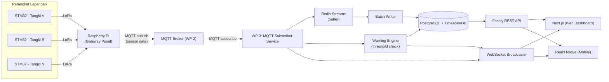
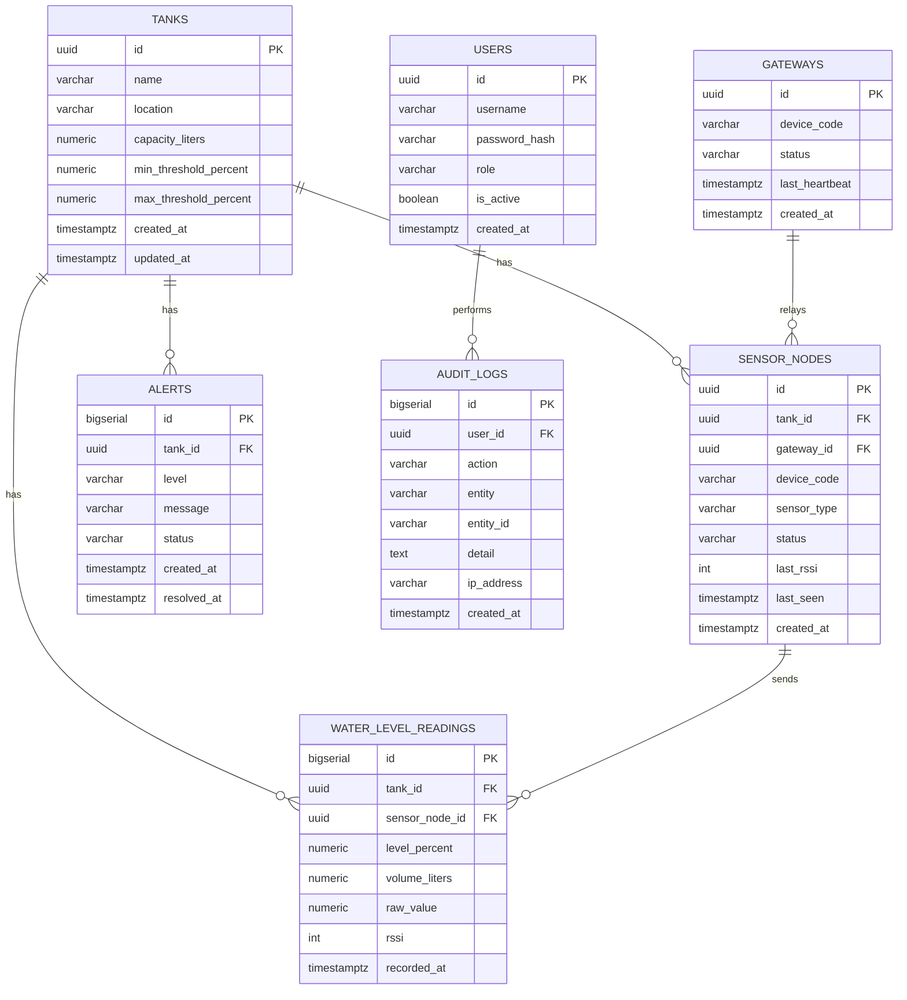

# WP-3 — Backend, Database & Monitoring/Warning Engine
### Integrated Hospital Water Tank Monitoring Research Project

> Dokumen ini adalah catatan kerja internal WP-3. Arsitektur perangkat keras yang menjadi acuan: setiap tangki menggunakan **STM32**, data dikirim via **LoRa** ke satu unit **Raspberry Pi** yang berperan sebagai gateway/hub pusat, baru diteruskan ke backend via MQTT.
> 
> **Status Scope:** Sistem ini berfokus murni sebagai **Monitoring & Early Warning System** (membaca level air, menyimpan histori time-series, dan mengeluarkan peringatan WARNING/CRITICAL jika terjadi anomali level air). Jalur otomasi aktuator/kontrol pompa telah ditiadakan.

---

## 1. Ringkasan Proyek

Sistem ini memantau level air pada beberapa tangki di rumah sakit (atap gedung utama, rawat inap, instalasi bedah, laboratorium, laundry, dst) secara terpusat, mendeteksi kondisi kritis, dan memberi peringatan (warning/critical) ke operator melalui dashboard web dan mobile.

WP-3 bertanggung jawab pada **inti pemrosesan data**: menerima data dari gateway (via MQTT yang disediakan WP-2), melakukan buffering pesan (mencegah lonjakan data), menyimpannya secara terstruktur di database PostgreSQL/TimescaleDB, mencatat histori & audit, mendeteksi kondisi peringatan melalui Warning Engine, serta menyediakan REST API dan WebSocket untuk dikonsumsi oleh WP-4 (web Next.js & mobile React Native).

**Alur perangkat fisik:**

```
[STM32 @ Tangki A] ─┐
[STM32 @ Tangki B] ─┤  LoRa   ┌────────────────┐   MQTT   ┌────────────┐
[STM32 @ Tangki C] ─┼────────▶│ Raspberry Pi   │─────────▶│  WP-3      │
[STM32 @ Tangki D] ─┤         │ (1 unit, hub)  │          │  Backend   │
[STM32 @ Tangki N] ─┘         └────────────────┘          └────────────┘
                                                                 │
                                                        PostgreSQL/Timescale
                                                                 │
                                                        API + WebSocket
                                                                 │
                                                     Next.js (web) / React Native (mobile)
```

---

## 2. Kebutuhan Sistem (Requirements)

### Functional
- Menerima data level air per tangki secara berkala dari gateway via MQTT.
- Menyimpan data mentah (raw) dan data hasil olahan (level %, volume liter) beserta timestamp.
- **Warning Engine**: Mendeteksi kondisi WARNING (30–60%) dan CRITICAL (<30%), lalu secara otomatis membuat atau menutup (resolve) entri alert.
- Mencatat **audit log** untuk aksi pengguna di sistem (login, perubahan konfigurasi threshold tangki, dsb).
- Menyediakan **REST API** untuk query data tangki, riwayat histori pembacaan (grafik 24 jam dengan agregasi), daftar alert aktif/histori, dan data gateway.
- Menyediakan **realtime channel** (WebSocket) untuk mendorong pembaruan level air dan notifikasi alert baru secara instan ke dashboard.
- Mendeteksi status koneksi node/gateway (online/offline) berdasarkan interval heartbeat dan pesan last seen.

### Non-Functional
- **Latency rendah**: Dari data masuk MQTT sampai terkirim ke API/WebSocket (target sub-detik s/d beberapa detik).
- **High throughput & buffering**: Tahan terhadap lonjakan pesan ketika banyak tangki mengirim data bersamaan dengan menggunakan Redis Streams sebagai buffer sebelum batch insert ke DB.
- **Penyimpanan time-series efisien**: Menggunakan PostgreSQL dengan ekstensi TimescaleDB (hypertable) agar query rentang waktu dan agregasi grafik 24 jam tetap cepat.
- **Reliable & resilient**: Penanganan diskoneksi MQTT dengan auto-reconnect.
- **Auditable**: Seluruh aktivitas administratif dan perubahan konfigurasi tercatat rapi dalam audit log.

---

## 3. Tech Stack

| Layer | Pilihan | Alasan Singkat |
|---|---|---|
| Runtime | **Node.js (LTS, v22+) & TypeScript** | Ekosistem MQTT & PostgreSQL matang, type-safety tinggi |
| Web Framework (API) | **Fastify** | Cepat, schema validation terintegrasi, plugin WebSocket resmi |
| MQTT Client | `mqtt` (npm) | Standar industri, stabil, mendukung QoS & auto-reconnect |
| Realtime ke FE | **WebSocket** (`@fastify/websocket`) | Push update level & alert langsung ke Next.js & React Native |
| Database | **PostgreSQL** | Database relasional handal untuk master data |
| Ekstensi Time-Series | **TimescaleDB** (extension PostgreSQL) | Efisien untuk pembacaan sensor volume tinggi + agregasi grafik 24 jam |
| Buffer / Ingestion Queue | **Redis Streams** | Menampung burst pesan MQTT sebelum batch-insert ke database |
| ORM / Query Builder | **Drizzle ORM** | Type-safe, performa tinggi, ringan, migrasi skema mudah |
| Validasi | **Zod** | Validasi payload MQTT dan input request API |
| Autentikasi API | **JWT** (`@fastify/jwt`) | Autentikasi token untuk endpoint REST API |
| Manajemen Proses | **Worker terpisah** | Pemisahan proses HTTP API dan MQTT Ingestion Worker |

---

## 4. Arsitektur



**Catatan Arsitektur:**
- **Sistem Satu Arah (One-Way Data Flow):** Data mengalir dari sensor perangkat lapangan ke gateway, dipublish ke MQTT broker, diolah oleh backend WP-3, dan disajikan ke frontend WP-4.
- **Pemisahan Worker & API:** Ingest data sensor (MQTT + Redis Streams) dijalankan secara independen sehingga lonjakan pengiriman pesan dari banyak tangki tidak memperlambat respon Fastify REST API.
- **Warning Engine Realtime:** Pengecekan threshold langsung dievaluasi saat pesan sensor masuk untuk memastikan alert peringatan segera disiarkan via WebSocket tanpa menunggu proses batch-insert database selesai.

---

## 5. Komunikasi Data (MQTT)

Komunikasi dengan WP-2 (Gateway & Broker) menggunakan protokol **MQTT**:

| Topic | Arah | QoS | Keterangan |
|---|---|---|---|
| `hospital/{tank_id}/level` | Gateway → Backend | 0 | Data level air periodik, frekuensi tinggi |
| `hospital/{tank_id}/status` | Gateway → Backend | 1 | Status konektivitas dan kesehatan node sensor |
| `hospital/{tank_id}/heartbeat` | Gateway → Backend | 0 | Keep-alive berkala per node / gateway |

### Contoh Payload (`level`)
```json
{
  "tank_id": "TANK-A",
  "sensor_node_id": "STM32-A01",
  "level_percent": 72.4,
  "volume_liters": 1450,
  "raw_value": 812,
  "rssi": -78,
  "timestamp": "2026-09-14T10:25:00Z"
}
```

### Contoh Payload (`status`)
```json
{
  "tank_id": "TANK-A",
  "sensor_node_id": "STM32-A01",
  "status": "online",
  "battery_level": 94,
  "timestamp": "2026-09-14T10:25:00Z"
}
```

---

## 6. Alur Data (End-to-End)

1. STM32 di masing-masing tangki membaca sensor ketinggian air secara periodik.
2. Data dikirimkan via modul radio **LoRa** ke satu unit Raspberry Pi (gateway pusat).
3. Raspberry Pi mem-publish pesan data ke **MQTT broker** (dikelola WP-2) sesuai topic `hospital/{tank_id}/...`.
4. **MQTT Subscriber Service** (WP-3) menerima pesan, memvalidasi integritas data dengan **Zod**, lalu:
   - Memasukkan data ke buffer **Redis Streams**.
   - Meneruskan data ke **Warning Engine** untuk evaluasi threshold secara realtime.
5. **Batch Writer** membaca data dari Redis Streams secara berkala/berkelompok (batch), lalu menginsert ke tabel time-series **PostgreSQL/TimescaleDB**.
6. Jika level air masuk ke rentang WARNING (30–60%) atau CRITICAL (<30%), Warning Engine otomatis mencatat record di tabel `alerts` dan memicu **WebSocket Broadcaster**.
7. Jika level air kembali normal, alert yang aktif otomatis ditandai sebagai `resolved`.
8. **WebSocket Broadcaster** mendorong pembaruan level air dan notifikasi alert terbaru ke web Next.js & aplikasi mobile React Native.
9. Dashboard memanggil **REST API** Fastify untuk menampilkan grafik historis 24 jam, master data tangki, status node sensor, dan riwayat alert.

---

## 7. Skema Database (PostgreSQL & TimescaleDB)

### Entitas Utama (7 Core Tables)
- **tanks** — Master data tangki (nama, kapasitas, lokasi, batas threshold peringatan).
- **gateways** — Data unit Raspberry Pi perantara LoRa ke MQTT.
- **sensor_nodes** — Data modul node STM32 per tangki.
- **water_level_readings** — Data time-series hasil pembacaan sensor (hypertable TimescaleDB).
- **alerts** — Riwayat peringatan WARNING/CRITICAL beserta status penanganannya.
- **users** — Akun operator dan administrator sistem.
- **audit_logs** — Riwayat jejak audit aktivitas pengguna dan sistem.

### ERD (Mermaid)



### Catatan Implementasi Database
- `water_level_readings` diatur sebagai **hypertable TimescaleDB** dengan partisi berbasis kolom `recorded_at`, dilengkapi continuous aggregate untuk query grafik 24 jam yang cepat.
- Indeks komposit dibuat pada `(tank_id, recorded_at DESC)` di tabel `water_level_readings`.
- Kolom `alerts.status` menggunakan enum/tipe data: `'active'` dan `'resolved'`.
- Status `sensor_nodes.status` dan `gateways.status` diperbarui berdasarkan pesan heartbeat/last seen untuk mendeteksi perangkat offline secara otomatis.

---

## 8. Catatan Pengembangan & Integrasi
- Kebijakan retensi data dan downsampling di TimescaleDB (misal: data mentah disimpan 30 hari, data agregasi per jam disimpan 1 tahun).
- Koordinasi spesifikasi skema response REST API dan event payload WebSocket dengan tim WP-4 (Frontend).
- Mekanisme autentikasi JWT token antara Fastify backend dan client dashboard (WP-4).
- Strategi buffering lokal di Raspberry Pi jika koneksi internet/MQTT sempat terputus.