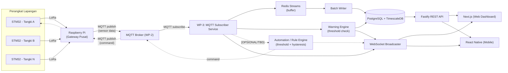
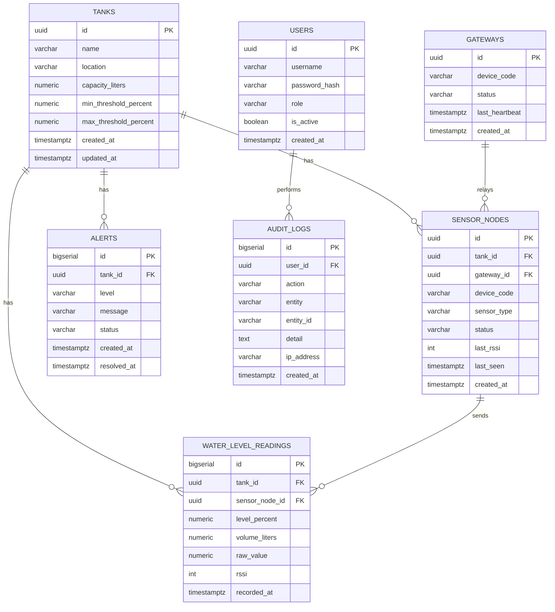
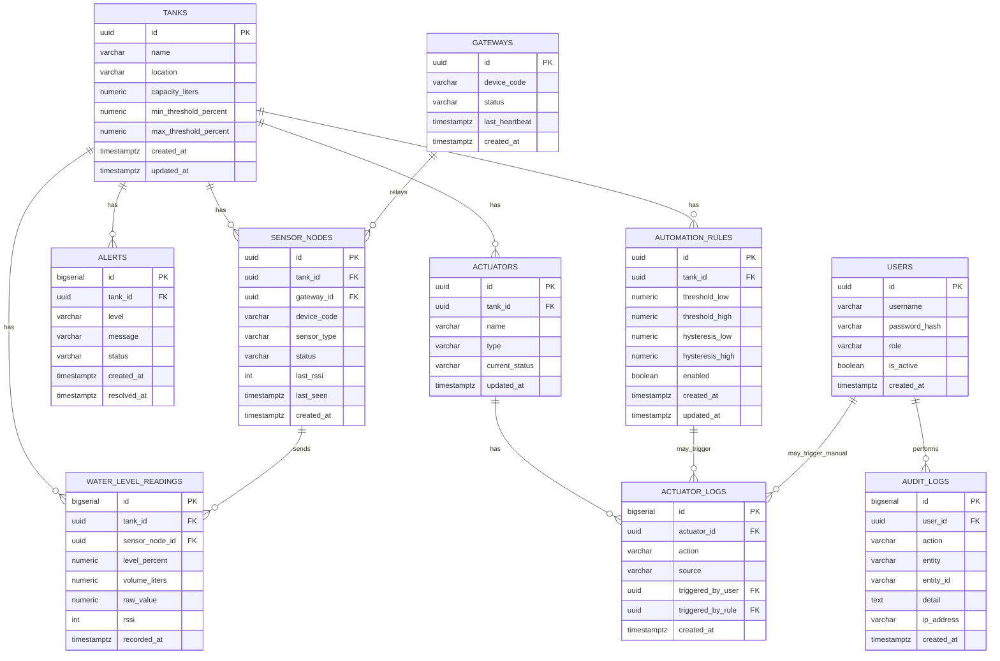

# WP-3 — Backend, Database & Automation Engine
### Integrated Hospital Water Tank Monitoring Research Project

> Dokumen ini adalah catatan kerja internal WP-3. Arsitektur perangkat keras yang menjadi acuan **sudah dikoreksi** dari infografis awal: setiap tangki menggunakan **STM32** (bukan Raspberry Pi per tangki), data dikirim via **LoRa** ke satu unit **Raspberry Pi** yang berperan sebagai gateway/hub pusat, baru diteruskan ke backend.

---

## 1. Ringkasan Proyek

Sistem ini memantau level air pada beberapa tangki di rumah sakit (atap gedung utama, rawat inap, instalasi bedah, laboratorium, laundry, dst) secara terpusat, sekaligus melakukan otomasi pompa/valve berbasis logika hysteresis, dan memberi peringatan (warning/critical) ke operator melalui dashboard web dan mobile.

WP-3 bertanggung jawab pada **inti pemrosesan data**: menerima data dari gateway (via MQTT yang disediakan WP-2), menyimpannya secara terstruktur di database, mencatat histori & audit, serta menyediakan API untuk dikonsumsi oleh WP-4 (web Next.js & mobile React Native).

> ⚠️ **Status scope (update):** Fitur **automation (kontrol otomatis pompa/valve)** kemungkinan **tidak jadi diimplementasikan**. Jika ini final, proyek berubah menjadi **monitoring & warning system saja** — sistem membaca level, menyimpan histori, dan mengeluarkan peringatan (WARNING/CRITICAL), tanpa mengirim command otomatis untuk menyalakan/mematikan pompa. Bagian yang berkaitan dengan automation di dokumen ini ditandai **[OPSIONAL/TBD]** dan bisa dihapus kalau keputusan sudah final tidak jadi.

**Alur perangkat fisik (revisi):**

```
[STM32 @ Tangki A] ─┐
[STM32 @ Tangki B] ─┤  LoRa   ┌────────────────┐   MQTT   ┌────────────┐
[STM32 @ Tangki C] ─┼────────▶│ Raspberry Pi   │─────────▶│  WP-3      │
[STM32 @ Tangki D] ─┤         │ (1 unit, hub)  │◀─────────│  Backend   │
[STM32 @ Tangki N] ─┘         └────────────────┘  command └────────────┘
                                                                 │
                                                        PostgreSQL/Timescale
                                                                 │
                                                        API + WebSocket
                                                                 │
                                                     Next.js (web) / React Native (mobile)
```

---

## 2. Kebutuhan Sementara (Requirements)

### Functional
- Menerima data level air per tangki secara berkala dari gateway via MQTT.
- Menyimpan data mentah (raw) dan data hasil olahan (level %, volume liter) beserta timestamp.
- Mendeteksi kondisi WARNING (30–60%) dan CRITICAL (<30%), lalu membuat/menutup alert — **ini fitur inti**, terlepas dari jadi/tidaknya automation.
- **[OPSIONAL/TBD] Automation engine**: evaluasi threshold + hysteresis untuk memutuskan ON/OFF pompa/valve secara otomatis, lalu mengirim command kembali ke gateway. *Kemungkinan tidak jadi diimplementasikan — perlu keputusan final.*
- **[OPSIONAL/TBD] Kontrol manual** dari operator (override pompa/valve) melalui API. Ini hanya relevan jika sistem tetap punya jalur kontrol (baik manual maupun auto); kalau proyek murni monitoring & warning, kemungkinan tidak ada kontrol sama sekali dari sisi backend.
- Mencatat **audit log** untuk aksi user (login, kontrol manual pompa, perubahan rule, dsb).
- Menyediakan REST API untuk histori (grafik 24 jam) dan **realtime channel** (WebSocket/SSE) untuk update level & status secara langsung ke dashboard.
- Mendeteksi status koneksi node/gateway (online/offline) berdasarkan heartbeat/last seen.

### Non-Functional
- Latency rendah dari data masuk MQTT sampai tersedia di API/WebSocket (target sub-detik s/d beberapa detik).
- Tahan terhadap lonjakan pesan (banyak tangki mengirim bersamaan) — perlu buffering, bukan insert langsung per pesan.
- Data historis tersimpan efisien untuk time-series (kemungkinan volume tinggi jika interval pembacaan pendek).
- Reliable: pesan MQTT boleh terputus sementara tanpa kehilangan command penting (QoS diperhatikan).
- Auditable: semua aksi kontrol harus tertelusuri (siapa/apa yang memicu, kapan).

---

## 3. Tech Stack

| Layer | Pilihan | Alasan Singkat |
|---|---|---|
| Runtime | **Node.js (LTS, v22+)** | Ekosistem MQTT & PostgreSQL paling matang/stabil |
| Web Framework (API) | **Fastify** | Cepat, schema-based validation, plugin WebSocket resmi |
| MQTT Client | `mqtt` (npm) | Standar, stabil, dukung QoS & reconnect |
| Realtime ke FE | **WebSocket** (`@fastify/websocket`) | Push update level/alert langsung ke Next.js & React Native |
| Database | **PostgreSQL** | Sudah ditentukan oleh tim |
| Ekstensi Time-Series | **TimescaleDB** (extension di atas Postgres) | Efisien untuk data pembacaan sensor volume tinggi + agregasi grafik 24 jam, tanpa ganti DB engine |
| Buffer/Queue | **Redis Streams** | Menampung burst pesan MQTT sebelum batch-insert ke DB, mencegah bottleneck |
| ORM/Query Builder | **Drizzle ORM** | Type-safe, ringan, cocok dipakai bersama TypeScript |
| Validasi | **Zod** | Validasi payload MQTT & request API |
| Auth (backend side) | **JWT** | Autentikasi API yang dikonsumsi WP-4 (AAA UI di WP-4, tapi issue/verify token di WP-3) |
| Proses | **Worker terpisah** untuk MQTT subscriber vs proses HTTP API (bisa `worker_threads` atau proses Node terpisah) | Supaya beban ingest data tidak mengganggu response API |

---

## 4. Arsitektur



Catatan:
- **MQTT Subscriber Service** dan **Fastify REST API** dijalankan sebagai proses terpisah agar ingest data tidak membebani response time API.
- Jalur bertanda garis putus-putus (`Automation / Rule Engine` dan command balik ke gateway) adalah **[OPSIONAL/TBD]** — jika automation tidak jadi, backend cukup punya **Warning Engine** yang murni membaca threshold untuk membuat alert, tanpa mengirim command apapun ke gateway. Ini menyederhanakan sistem menjadi satu arah: sensor → backend → dashboard.
- Jika automation memang tidak jadi, pertanyaan riset WP-3 di infografis (*"Bagaimana logika kontrol dapat bekerja aman dan konsisten pada kondisi nyata?"*) perlu disesuaikan jadi lebih ke arah *"Bagaimana sistem peringatan dapat akurat dan tidak terlambat/false alarm?"*

---

## 5. Komunikasi

Komunikasi dengan WP-2 sepenuhnya lewat **MQTT**. Usulan desain topic:

| Topic | Arah | QoS | Keterangan |
|---|---|---|---|
| `hospital/{tank_id}/level` | Gateway → Backend | 0 | Data level air periodik, frekuensi tinggi |
| `hospital/{tank_id}/status` | Gateway → Backend | 1 | Status pompa/valve, konektivitas node |
| `hospital/{tank_id}/heartbeat` | Gateway → Backend | 0 | Keep-alive per node/gateway |
| `hospital/{tank_id}/command` | Backend → Gateway | 1 | Perintah ON/OFF pompa/valve |
| `hospital/{tank_id}/command/ack` | Gateway → Backend | 1 | Konfirmasi command sudah dieksekusi |

Contoh payload (`level`):
```json
{
  "tank_id": "TANK-A",
  "sensor_node_id": "STM32-A01",
  "level_percent": 72.4,
  "volume_liters": 1450,
  "raw_value": 812,
  "rssi": -78,
  "timestamp": "2026-09-06T10:25:00Z"
}
```

Contoh payload (`command`):
```json
{
  "tank_id": "TANK-A",
  "actuator": "PUMP-1",
  "action": "ON",
  "source": "auto",
  "rule_id": "rule-uuid",
  "timestamp": "2026-09-06T10:25:03Z"
}
```

---

## 6. Alur Data (End-to-End)

1. STM32 di masing-masing tangki membaca sensor level secara periodik.
2. Data dikirim via **LoRa** ke Raspberry Pi (gateway tunggal).
3. Raspberry Pi mem-publish data ke **MQTT broker** (disediakan/dikelola WP-2) sesuai topic di atas.
4. **MQTT Subscriber Service** (WP-3) menerima pesan, validasi schema (Zod), lalu:
   - Dorong ke **Redis Streams** sebagai buffer.
   - Teruskan ke **Warning Engine** untuk cek threshold (WARNING/CRITICAL) secara realtime.
   - **[OPSIONAL/TBD]** Teruskan juga ke **Automation Engine** untuk evaluasi threshold/hysteresis, jika fitur ini jadi digunakan.
5. **Batch Writer** membaca dari Redis Streams secara berkala/berbatch, lalu insert ke **PostgreSQL/TimescaleDB** (mencegah insert-per-pesan yang mahal).
6. Jika level masuk zona WARNING/CRITICAL dan bertahan melewati durasi tertentu, sistem membuat entri `alerts` baru (atau menutup alert lama jika kondisi pulih). **Ini fitur inti** yang tetap ada terlepas dari status automation.
7. **[OPSIONAL/TBD]** Jika Automation Engine aktif dan memutuskan perlu aksi (mis. level ≤30% → pompa ON), sistem:
   - Menulis `actuator_logs` (source = `auto`).
   - Publish command balik ke topic `.../command`.
   - Menunggu `command/ack` untuk konfirmasi status aktual.
8. **WebSocket Broadcaster** mendorong update level dan alert baru (serta status pompa, jika automation ada) ke seluruh client yang terhubung (dashboard Next.js & mobile React Native) secara realtime.
9. Untuk kebutuhan histori (grafik 24 jam, audit trail), FE memanggil **REST API** yang query dari PostgreSQL/TimescaleDB (dengan agregasi bila perlu).
10. **[OPSIONAL/TBD]** Jika masih ada kontrol manual dari operator (via dashboard): masuk melalui REST API → tervalidasi (auth JWT) → dieksekusi (publish command MQTT) → tercatat di `actuator_logs` (source = `manual`) dan `audit_logs`. Jika sistem murni monitoring & warning, langkah ini tidak berlaku dan `audit_logs` cukup mencatat aktivitas non-kontrol (login, akses data, dsb).

---

## 7. Skema Database (Analisis Awal) — PostgreSQL

### Entitas utama
- **tanks** — master data tangki (kapasitas, lokasi, threshold). *Inti.*
- **gateways** — unit Raspberry Pi (saat ini 1, tapi dibuat generik agar bisa lebih dari satu di masa depan). *Inti.*
- **sensor_nodes** — unit STM32 per tangki, terhubung ke satu gateway via LoRa. *Inti.*
- **water_level_readings** — data time-series hasil pembacaan sensor (kandidat kuat untuk **hypertable TimescaleDB**, volume paling tinggi). *Inti.*
- **alerts** — riwayat kondisi WARNING/CRITICAL beserta status resolve. *Inti.*
- **users** — akun operator/admin (dipakai bersama WP-4 untuk AAA, minimal untuk login & lihat dashboard). *Inti.*
- **audit_logs** — jejak aktivitas user di sistem (login, akses data, dsb). *Inti, cakupannya menyempit kalau tidak ada kontrol.*
- **actuators** — pompa/valve per tangki. **[OPSIONAL/TBD]** — hanya relevan jika sistem tetap menampilkan/mengontrol status pompa; kalau murni monitoring level air tanpa aktuator sama sekali, tabel ini bisa dihapus.
- **actuator_logs** — histori aksi ON/OFF. **[OPSIONAL/TBD]** — tergantung apakah masih ada kontrol manual dari dashboard.
- **automation_rules** — konfigurasi threshold & hysteresis untuk automation. **[OPSIONAL/TBD]** — kandidat pertama untuk dihapus kalau automation resmi tidak jadi. Threshold untuk warning saja cukup disimpan di kolom `tanks.min_threshold_percent` / `max_threshold_percent`, tidak perlu tabel rule terpisah.

### ERD (Mermaid)

#### Opsi 1: Tanpa Automation (Monitoring & Warning Saja) — *Rekomendasi jika otomasi tidak jadi*



#### Opsi 2: Lengkap dengan Automation & Aktuator (Opsional / TBD)



### Catatan implementasi
- `water_level_readings` disarankan menjadi **hypertable TimescaleDB** dengan partisi berbasis `recorded_at`, ditambah continuous aggregate untuk kebutuhan grafik 24 jam agar query dashboard tetap cepat walau data mentah menumpuk.
- `actuator_logs.triggered_by_user` **nullable** (diisi hanya jika `source = 'manual'`); `triggered_by_rule` **nullable** (diisi hanya jika `source = 'auto'`).
- `alerts.status` disarankan enum: `active`, `resolved`.
- `sensor_nodes.status` & `gateways.status` diperbarui berdasarkan heartbeat untuk mendeteksi node/gateway offline.
- Pertimbangkan index pada `(tank_id, recorded_at)` di `water_level_readings` karena jadi pola query paling umum (histori per tangki, per rentang waktu).

---

## 8. Belum Dibahas / Untuk Iterasi Berikutnya
- **Keputusan final: automation jadi atau tidak.** Ini menentukan apakah tabel `actuators`, `actuator_logs`, `automation_rules`, serta seluruh jalur command di arsitektur dipertahankan atau dihapus. Perlu dikomunikasikan juga ke WP-1 (apakah STM32/relay pompa tetap dipasang) dan WP-4 (apakah dashboard tetap butuh tampilan kontrol pompa atau cukup monitoring + alert).
- Detail retensi data & kebijakan downsampling di TimescaleDB.
- Spesifikasi lengkap REST API (endpoint, request/response) untuk dikoordinasikan dengan WP-4.
- Mekanisme auth token antara backend dan Next.js/React Native (refresh token, session, dsb).
- Strategi penanganan jika gateway (Raspberry Pi) offline dalam durasi lama.